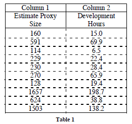
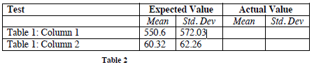
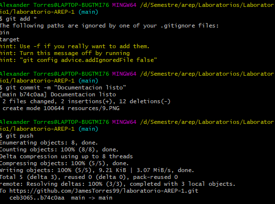
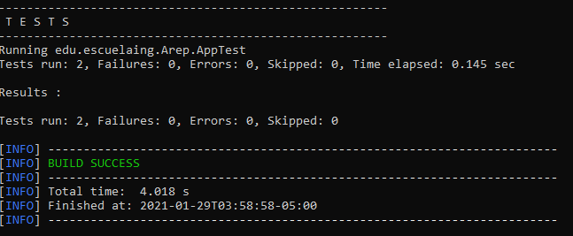
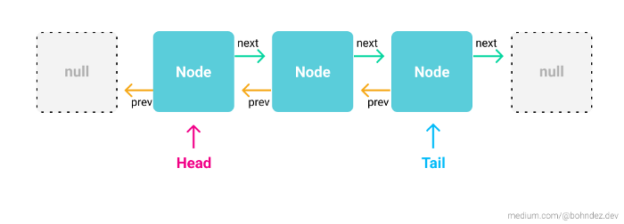
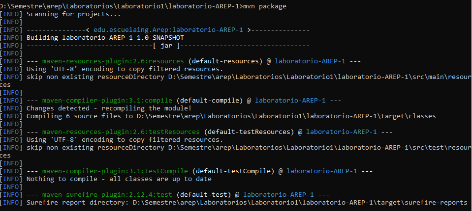
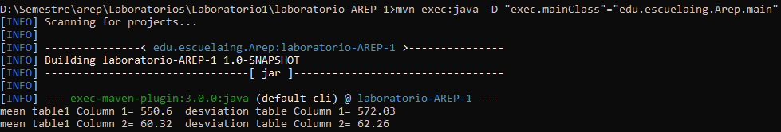
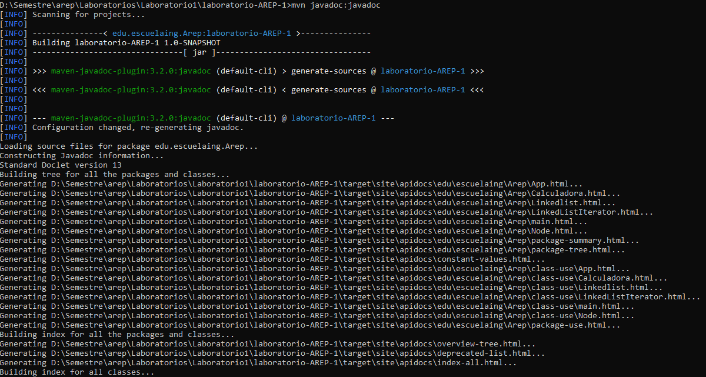

# *AREP - Laboratorio 1*
# INTRODUCTION TO COMPLEX SYSTEMS, JAVA, MVN, AND GIT

## Integrantes:

- James Torres

## Use Maven and GITHUB.

Escriba un programa para calcular la desviación estándar y media de un conjunto de n números reales.
Su programa lee los n números reales de un archivo.

Pruebe minuciosamente el programa. Al menos dos pruebas deben utilizar los datos de las columnas de la Tabla 1. Los resultados esperados se proporcionan en la Tabla 2.


Tabla 1 :


		
Tabla 2 :



usando GIT añadimos a nuestro repositorio los documentos y fuentes.


<br></br>

Resultado :


<br></br>

## Doubly linked list


Las Doubly linked list son estructuras de datos un poco complejas donde asignación de memoria se realiza en el momento de la ejecución son simplemente un conjunto de nodos ordenados que contienen valores.


<br></br>

En esta listas :

- Cada uno tiene un valor y una referencia a un siguiente nodo.

- El puntero anterior del primer nodo (head) debe apuntar hacia NULL.

- El puntero siguiente del último nodo (tail) debe apuntar hacia NULL.


<br></br>

Cuando se desea eliminar un elemento solamente cambia la referencia hacia el nuevo nodo.


<br></br>


**Compilar el proyecto con maven**
```
mvn package
```

<br></br>

**Ejecutar el proyecto con maven**
```
mvn exec:java -D "exec.mainClass"="edu.escuelaing.Arep.main"
```

<br></br>

**Ejecutar pruebas del proyecto con maven**
```
mvn test
```

<br></br>

**Obtener Documentacion del proyecto con maven**

El ejecutable de javadoc "index.html" se encuentra en target\site\apidocs al ejecutar el siguiente comando:
```
mvn javadoc:javadoc
```

<br></br>

## REFERENCIAS

- <https://www.aprenderaprogramar.com/index.php?option=com_content&view=article&id=589:interface-iterable-y-metodo-iterator-api-java-recorrer-colecciones-ejercicio-y-ejemplo-resuelto-cu00915c&catid=58&Itemid=180#:~:text=La%20interface%20Iterator%20(del%20paquete,iterador%20tiene%20un%20siguiente%20elemento.>
- <https://stackoverflow.com/questions/11701399/round-up-to-2-decimal-places-in-java>
- <https://visualgo.net/en/list>
- <https://medium.com/@bohndez.dev/estructuras-de-datos-linked-list-en-javascript-e84f3c50a4c4#:~:text=Cada%20uno%20tiene%20un%20valor,%2C%20number%2C%20boolean%2C%20etc.>
- <https://www.programiz.com/java-programming/examples/standard-deviation>
